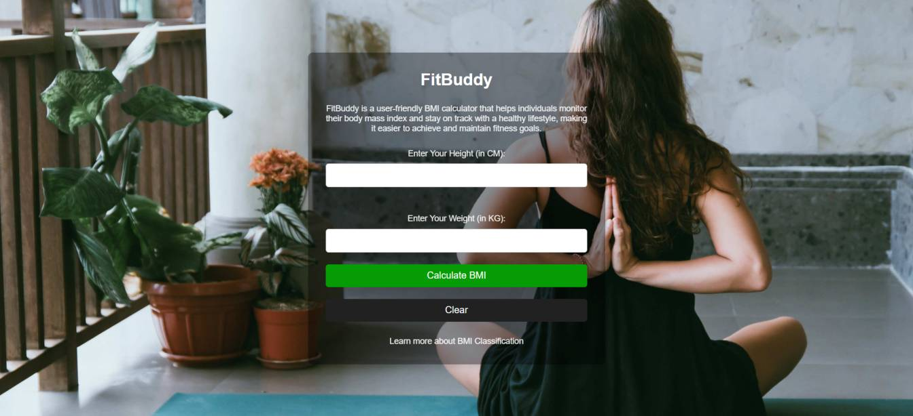
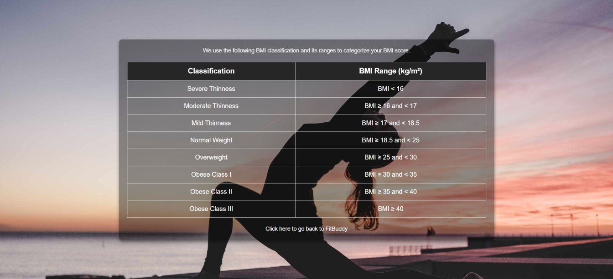

# FitBuddy

FitBuddy is a web application designed to help users calculate their Body Mass Index (BMI). With FitBuddy, users can enter their height and weight to calculate their BMI and explore BMI classification categories to better understand their health.

## 🧘🏻‍♀️ Demo Screenshot




## 🔗 Live Demo

- Check out the app live here: **[FitBuddy](https://premkrrajbhar.github.io/FitBuddy/)**

## 🌟 Features

- **BMI Calculation**: Input your height and weight to calculate your BMI instantly.
- **BMI Classification**: Learn about the BMI classification ranges and what each category represents.
- **Clear Results**: Reset all inputs and results with a single click of the button.
- **BMI Category Details**: A second page provides detailed BMI classification.

## 🛠️ Technologies Used

- **HTML**: Provides the basic structure and layout for the web app.
- **CSS**: Styles the app with a clean, modern design to ensure a responsive user experience.
- **JavaScript**: Handles the BMI calculation and dynamic updates of the result on the home page.

## 💻 How to Use

- **Enter Your Height and Weight**: Input your height in centimeters and weight in kilograms.
- **Calculate Your BMI**: Click the "Calculate BMI" button to get your BMI result.
- **Clear Results**: Click the "Clear" button to reset all input fields and results.
- **Learn About BMI Classification**: Navigate to the "BMI Classification" page to understand what your BMI means and see the different categories.

## 📥 How to Run Locally

- Step 1: Clone the repository:

```bash
   git clone https://github.com/premkrrajbhar/FitBuddy.git
   ```

- Step 2: Navigate to the project folder:
```bash
   cd FitBuddy
   ```

- Step 3: Open the `index.html` file in your web browser to start using the app.

## 🤝 Contributing

Contributions are welcome! If you have suggestions or improvements, feel free to submit a pull request or open an issue.

## 📞 Contact

For any questions or feedback, please reach out to:


- **Email**: [premkumar224487@gmail.com](mailto:premkumar224487@gmail.com)
- **GitHub**: [premkrrajbhar](https://github.com/premkrrajbhar)
